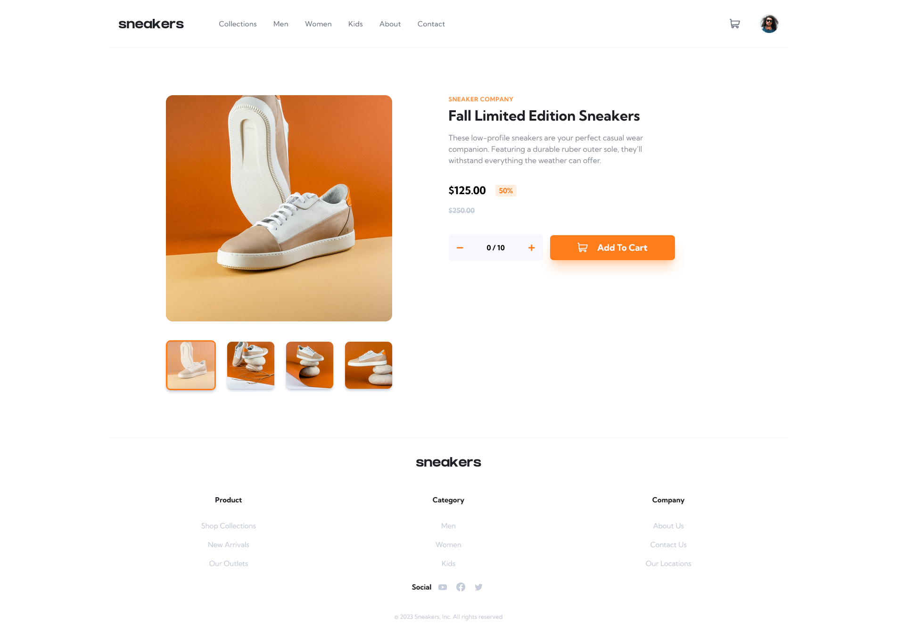

# Frontend Mentor - E-commerce product page solution

This is a solution to the [E-commerce product page challenge on Frontend Mentor](https://www.frontendmentor.io/challenges/ecommerce-product-page-UPsZ9MJp6).

## Table of contents

- [Overview](#overview)
  - [The challenge](#the-challenge)
  - [Screenshot](#screenshot)
  - [Links](#links)
- [My process](#my-process)
  - [Built with](#built-with)
- [Author](#author)
- [Acknowledgments](#acknowledgments)

## Overview

### Screenshot

- Desktop Preview

  

- Mobile Preview

  

### Links

- Solution URL: [Add solution URL here](https://github.com/AhmadYousif89/sneakers-shop)
- Live Site URL: [Add live site URL here](https://fe-sneakers.vercel.app)

### Built with

- Flexbox
- CSS Grid
- Semantic HTML5 markup
- Mobile-first workflow

- Typescript
- [Vite](https://vitejs.dev/) - Dev environment
- [React](https://reactjs.org/) - JS framework
- [TailwindCss](https://tailwindcss.com/) - Css library

## Author

- Frontend Mentor - [@Jo89](https://www.frontendmentor.io/profile/AhmadYousif89)
